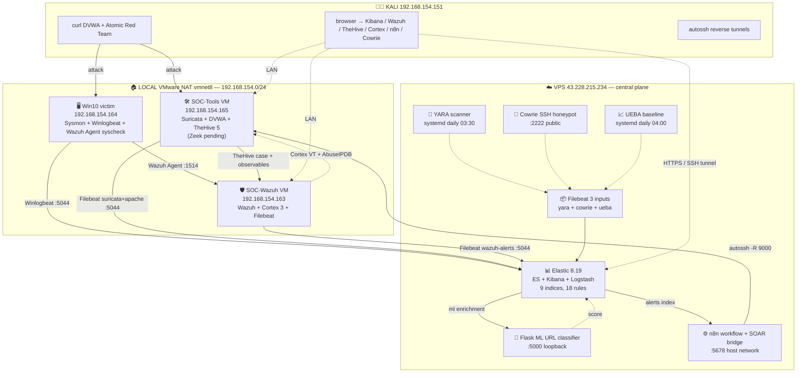

# VN-SOC Lab — Master Guide

> Single-page consolidated reference cho toàn bộ dự án. Cover architecture, all 15 phases, 18 detection rules, log sources, deployment quick-start, troubleshooting, interview talking points. Từng phần link tới per-phase docs cho deep dive.

**Cập nhật:** 2026-07-01
**Trạng thái:** 15 phases hoàn tất — CV-ready, lab reproducible
**Repo:** github.com/gnid31/vn-soc-lab

---

## Mục lục

1. [Executive summary](#1-executive-summary)
2. [Full architecture](#2-full-architecture)
3. [Phase timeline (1-15)](#3-phase-timeline)
4. [Detection rules R1-R18](#4-detection-rules)
5. [Log sources + indices](#5-log-sources)
6. [Deployment quick-start](#6-deployment-quick-start)
7. [Access & credentials matrix](#7-access-matrix)
8. [Troubleshooting reference](#8-troubleshooting)
9. [Skills & interview talking points](#9-skills-interview)
10. [File inventory](#10-file-inventory)

---

## 1. Executive summary

**VN-SOC Lab** = end-to-end Security Operations Center simulation cho intern-level SOC + AI Engineer roles.

| Metric | Value |
|---|---|
| Detection rules total | **18** (R1-R18) covering **19 MITRE ATT&CK techniques** |
| Kibana rule types | **4/5** (query + threshold + EQL sequence + new_terms + indicator match) |
| SIEMs parallel | **2** (Elastic + Wazuh) |
| SOAR pipeline | detect → case → observables → enrich → auto (TheHive + n8n + Cortex) |
| ML detection | R9 TF-IDF+LogReg URL classifier, Flask + gunicorn Docker |
| Log sources | **10 indices** (winlogbeat, suricata, dvwa-apache, wazuh-alerts, syslog, docker, yara-scan, cowrie, ueba, vuln-scan) |
| Vulnerability scanning | Trivy daily (Docker + FS CVE) + Nikto weekly (web endpoints) — R18 fire on HIGH/CRITICAL |
| Threat intel | URLhaus 5000 IOCs daily + VirusTotal + AbuseIPDB (Cortex analyzers) |
| Honeypot | Cowrie SSH port 2222 public — capture attacker sessions |
| UEBA | Python z-score baseline 6 metrics vs 14-day |
| FIM | Wazuh syscheck Win10 (dirs + registry) + ship to Elastic |
| Total commits | ~35 |
| Docs Vietnamese dual-path (GUI + CLI) | ~4500 lines |
| Time to reproduce end-to-end | ~8 giờ manual |

**Big picture:** Analyst nhấn 1 nút attack → 60-90s sau Kibana + TheHive show enriched case với ML score + threat intel report tất cả tự động.

---

## 2. Full architecture



**Data flow attack lifecycle:** Xem sequence diagram trong `README.md`.

---

## 3. Phase timeline

| Pha | Tên | Deliverable chính | Doc chi tiết |
|---|---|---|---|
| 1 | SIEM Backend | Elastic 8.19 (ES + Kibana + Logstash) trên VPS, TLS + UFW hardened | [`report.md §4`](report.md) |
| 2 | Endpoint Telemetry | Sysmon (SwiftOnSecurity + ProcessAccess RuleGroup) + Winlogbeat, 4400+ event/day | [`report.md §5`](report.md) |
| 3 | Detection Engineering R1-R5 | 5 KQL rules Windows telemetry MITRE-mapped | [`detection-rules/README.md`](detection-rules/) |
| 4 | Adversary Emulation | Atomic Red Team chain T1547→T1059→T1110, R5 FP -100% | [`pha4-results.md`](pha4-results.md) |
| 5 | Incident Response | NIST 800-61 Rev2 report `VN-SOC-2026-0001` kill-chain 3 tactics | [`incidents/VN-SOC-2026-0001-killchain.md`](incidents/) |
| 6 | Network IDS R6-R8 | Suricata + DVWA + 3 rules web attack (T1595/T1595.002/T1083) | [`pha6-results.md`](pha6-results.md) |
| 7 | Wazuh HIDS Full Stack | Multi-SIEM dual-ship, custom SOC-Wazuh VM | [`pha7-results.md`](pha7-results.md) |
| 8 | ML Detection R9 | TF-IDF + LogReg URL classifier, Flask + Docker | [`pha8-results.md`](pha8-results.md) |
| 9 | SOAR Case Mgmt | TheHive 5 + n8n + alert bridge, 34 cases auto | [`pha9-results.md`](pha9-results.md) |
| 9.5 | Cortex Analyzer | VT + AbuseIPDB auto-enrich observables | [`pha9.5-results.md`](pha9.5-results.md) |
| 10 | ELK Ops Optimization | ILM policy + saved objects + Data View filters + runtime field | [`ELK-GUIDE.md`](ELK-GUIDE.md) |
| 11 | SIEM Deep Skills R10-R13 | EQL sequence + Sigma workflow + geoip + IOC feed | [`pha11-results.md`](pha11-results.md) |
| 12 | SIEM Depth v2 | CV refresh + ECS aliases + log source diversification (syslog + docker) | [`pha12-results.md`](pha12-results.md) |
| 13 | FIM R14 | Wazuh syscheck Win10 + Filebeat ship → Elastic unified | [`pha13-results.md`](pha13-results.md) |
| 14 | Advanced SOC R15-R17 | YARA malware + Cowrie honeypot + UEBA + Zeek (Zeek defer) | [`pha14-results.md`](pha14-results.md) |
| 15 | Vulnerability Management R18 | Trivy Docker+FS scan + Nikto weekly web + systemd timers + R18 rule | [`pha15-results.md`](pha15-results.md) |

---

## 4. Detection rules

| Rule | Type | MITRE | Source | Severity |
|---|---|---|---|---|
| R1 | Query | T1059.001 PowerShell Encoded | Sysmon e1 | High |
| R2 | Query | T1003.001 LSASS Access | Sysmon e10 | Critical |
| R3 | Query | T1547.001 Registry Run Key | Sysmon e13 | Medium |
| R4 | Threshold | T1110 Brute Force | Security 4625 | High |
| R5 | Query | T1071.001 Non-Browser Outbound | Sysmon e3 | Medium |
| R6 | Query | T1595 Network Scan | Suricata alert | Medium |
| R7 | Query | T1595.002 Suspicious UA | DVWA Apache | Medium |
| R8 | Query | T1083 Sensitive File Probe | DVWA Apache | Medium |
| R9 | Query | T1190 ML Malicious URL | DVWA + Flask ML | High |
| R10 | **EQL sequence** | T1003.001 + T1059 multi-stage | Sysmon e1+e3+e10 chain 10min | Critical |
| R11 | **Threshold** | T1110 Web brute force | DVWA POST /login.php | High |
| R12 | **New Terms** | T1204 First-seen process image | Sysmon e1, 14d window | Medium |
| R13 | Query (Indicator match) | T1189 URLhaus IOC match | Logstash IOC tag | Critical |
| R14 | Query | T1547.001 + T1562.001 Wazuh FIM | wazuh-alerts syscheck | High |
| R15 | Query | T1105 + T1204 YARA malware | yara-scan match | Critical |
| R16 | Query | T1595 + T1110 Cowrie honeypot | Cowrie login/command | Critical |
| R17 | Query | T1078 UEBA anomaly | ueba z-score ≥ 2.0 | High |
| R18 | Query | T1190 + T1195 Vuln scanner | vuln-scan Trivy+Nikto HIGH/CRITICAL | Critical |

**MITRE ATT&CK techniques covered (19):** T1003.001, T1027, T1053.003, T1059/.001, T1071.001, T1078, T1083, T1098/.004, T1105, T1110, T1189, T1190, T1195/.002, T1204, T1543.002, T1547.001, T1562.001, T1595/.002.

---

## 5. Log sources

| Index | Source | Fields (ECS + custom) |
|---|---|---|
| `winlogbeat-*` | Win10 Sysmon + Security + PowerShell + DNS Client | `winlog.event_data.*`, `event.code`, `host.name`, ECS aliases (`process.executable`, `user.name`, `file.path`, `registry.key`, `dns.question.name`) |
| `suricata-*` | Suricata NIDS eve.json | `event_type`, `alert.signature`, `src_ip`, `dest_ip`, `source.geo.*` (geoip), `source.as.*` |
| `dvwa-apache-*` | Apache access log (DVWA) | grok COMBINEDAPACHELOG → `url.original`, `source.address`, `user_agent.*`, `ml.score`, `ml.label`, `attack_score` (runtime), `threat.indicator.provider` (IOC) |
| `wazuh-alerts-*` | Wazuh Manager alerts.json | `rule.id`, `rule.level`, `syscheck.path`, `syscheck.event`, `agent.name` |
| `syslog-*` | rsyslog forwarding | `log.syslog.severity/facility`, `host.hostname`, `message` |
| `docker-*` | Docker JSON logs | `message`, `container.*` |
| `yara-scan-*` | YARA scanner NDJSON | `yara.rule`, `yara.severity`, `file.path`, `file.hash.sha256` |
| `cowrie-*` | Cowrie SSH honeypot cowrie.json | `eventid`, `src_ip`, `username`, `password`, `input`, `session` |
| `ueba-*` | UEBA Python script output | `ueba.metric`, `ueba.today_value`, `ueba.baseline_mean`, `ueba.z_score`, `ueba.is_anomaly` |
| `vuln-scan-*` | Trivy + Nikto scanner output | `vuln.scanner`, `vuln.cve`, `vuln.severity`, `vuln.package`, `vuln.target`, `vuln.fixed_version` |

**ILM policy:** `vnsoc-30d` áp cho tất cả (hot 7d → warm shrink + forcemerge → delete 30d).

---

## 6. Deployment quick-start

Sau khi clone repo, deploy theo thứ tự:

### 6.1 Prerequisites (checklist)

| Item | Check |
|---|---|
| VPS Ubuntu 24.04 với ≥ 8 GB RAM | `free -h` |
| Kali Linux workstation | attacker + analyst host |
| 3 VMware VMs local: Win10, SOC-Tools (Ubuntu 22.04), SOC-Wazuh (Ubuntu 22.04) | vmnet8 NAT 192.168.154.0/24 |
| SSH key vào VPS | `ssh-copy-id vps` |
| Domain / static IP VPS (optional) | Cortex + Cowrie public reachable |

### 6.2 VPS side (Elastic + services)

```bash
# 1. Pha 1 — Elastic stack
sudo apt install elasticsearch=8.19.17 kibana=8.19.17 logstash=8.19.17
# → Config heap 512MB, TLS, encryption keys — xem report.md §4

# 2. Pha 8 — ML detection
cd ml-detection/api && docker compose up -d --build

# 3. Pha 9 — n8n + alert bridge
cd soar/n8n && docker compose up -d
sudo cp soar/bridge/*.{service,timer} /etc/systemd/system/
sudo systemctl enable --now vnsoc-soar.timer

# 4. Pha 10 — ILM + saved objects
curl -X PUT ".../_ilm/policy/vnsoc-30d" -d @elk-configs/ilm-vnsoc-30d.json
curl -X PUT ".../_index_template/vnsoc-lab" -d @elk-configs/index-template-vnsoc.json
curl -X POST ".../_component_template/vnsoc-long-text" -d @elk-configs/component-template-long-text.json
curl -X POST ".../saved_objects/_import?overwrite=true" -F file=@elk-configs/saved-objects/vnsoc-all.ndjson

# 5. Pha 11 — IOC feed + Sigma
sudo cp configs/ioc-feed-updater.sh /opt/vnsoc-ioc/
sudo cp configs/vnsoc-ioc-update.{service,timer} /etc/systemd/system/
sudo systemctl enable --now vnsoc-ioc-update.timer

# 6. Pha 14 — YARA + Cowrie + UEBA
sudo apt install yara filebeat=8.19.17
sudo cp fim/yara/*.{yar,sh,service,timer} /etc/yara/rules /opt/vnsoc-yara /etc/systemd/system
sudo cp ueba/*.{py,service,timer} /opt/vnsoc-ueba /etc/systemd/system
cd honeypot/cowrie && docker compose up -d
sudo cp fim/yara/filebeat-vpsside.yml /etc/filebeat/filebeat.yml
sudo systemctl enable --now filebeat vnsoc-yara.timer vnsoc-ueba.timer

# 7. Import 18 detection rules
for f in detection-rules/R*.ndjson; do
  curl -X POST ".../detection_engine/rules/_import" -F file=@$f
done
```

### 6.3 Windows 10 endpoint

```powershell
# Pha 2 — Sysmon + Winlogbeat (report.md §5)
# Pha 7 — Wazuh Agent MSI (pha7-results.md §3.7)
# Pha 13 — Enable syscheck in ossec.conf (fim/win10/syscheck-additions.xml)
```

### 6.4 SOC-Tools VM (Ubuntu 22.04)

```bash
# Pha 6 — Suricata + DVWA (pha6-results.md)
sudo apt install suricata
docker compose -f configs/docker-compose-dvwa.yml up -d

# Pha 9 — TheHive stack (pha9-results.md)
cd soar/thehive && docker compose up -d

# Pha 14 (defer) — Zeek (pha14-results.md §3.4)
sudo apt install zeek
sudo cp configs/zeek/{node.cfg,local.zeek} /opt/zeek/etc /opt/zeek/share/zeek/site
sudo /opt/zeek/bin/zeekctl deploy
```

### 6.5 SOC-Wazuh VM (Ubuntu 22.04)

```bash
# Pha 7 — Wazuh stack (pha7-results.md §3)
cd soc-wazuh/wazuh-docker/single-node && docker compose up -d

# Pha 9.5 — Cortex (pha9.5-results.md §3.2)
cd soar/cortex && docker compose up -d

# Pha 13 — Filebeat ship alerts (pha13-results.md §3.3)
sudo apt install filebeat=8.19.17
sudo cp fim/soc-wazuh/filebeat.yml /etc/filebeat/filebeat.yml
sudo systemctl enable --now filebeat
```

### 6.6 Kali analyst host

```bash
# autossh persistent tunnels (Pha 10 C1)
sudo apt install autossh
sudo loginctl enable-linger $USER
mkdir -p ~/.config/systemd/user
# Copy service files từ repo... systemctl --user enable --now vnsoc-tunnel-*

# ML deps for retraining
python3 -m venv ~/ml-venv && source ~/ml-venv/bin/activate
pip install scikit-learn numpy pandas
```

---

## 7. Access matrix

| Service | URL | Credentials | Access path |
|---|---|---|---|
| Kibana | http://43.228.215.234:5601 | elastic / `<KIBANA_PASS>` | External HTTPS |
| Elasticsearch | https://localhost:9200 (VPS only) | elastic / `<ES_PASS>` | Loopback via SSH |
| Wazuh Dashboard | https://192.168.154.163 | admin / SecretPassword | LAN only |
| Wazuh Manager API | https://192.168.154.163:55000 | wazuh-wui / `MyS3cr37P450r.*-` | LAN |
| TheHive | http://192.168.154.165:9000 | soc@vn-soc-lab.local / `VnSocLab2026!` | LAN or VPS-tunnel |
| Cortex | http://192.168.154.163:9001 | soc@vn-soc-lab.local | LAN |
| n8n | http://127.0.0.1:5678 (VPS loopback) | admin@vn-soc-lab.local | SSH -L 5678 tunnel |
| Flask ML API | http://127.0.0.1:5000 (VPS loopback) | none (internal) | SSH -L or curl |
| Cowrie honeypot | ssh -p 2222 root@43.228.215.234 | any password (fake) | Public — attackers welcome |
| Wazuh Agent Win10 | (no UI) | — | Service `WazuhSvc` |

Passwords lưu trong `~/.secrets/credentials.md` (chmod 600, KHÔNG commit).

---

## 8. Troubleshooting

| Symptom | Likely cause | Fix | Ref |
|---|---|---|---|
| Kibana "Detection Engine permissions required" | Encryption keys missing từ kibana.keystore | Set 3 encryption keys → restart Kibana | [`report.md §6.7`](report.md) |
| Logstash pipeline fail startup | Config syntax hoặc plugin field name sai | `sudo /usr/share/logstash/bin/logstash --config.test_and_exit -f main.conf` | [`pha11-results.md §Lesson 1`](pha11-results.md) |
| Wazuh Manager restart loop | Command args sai TheHive 5 vs v4 | Check `--storage-directory` (not `--storage-type`) | [`pha9-results.md §Lesson 2`](pha9-results.md) |
| Cortex 3 API return 403 CSRF | POST require session + CSRF token | GUI bootstrap only after superadmin | [`pha9.5-results.md §Lesson 4`](pha9.5-results.md) |
| n8n dashboard "Cannot read savedObjectId" | Panel JSON deprecated schema | Use `panelRefName` + `references[]` không `embeddableConfig.savedObjectId` | [`ELK-GUIDE §5.1`](ELK-GUIDE.md) |
| Wazuh Agent Win10 duplicate name enrollment | MSI race: WazuhSvc start trước agent-auth | Force `agent-auth.exe` + `Restart-Service WazuhSvc` | [`pha7-results.md §Lesson 4`](pha7-results.md) |
| Kibana Maps "no geo field" | Field dynamic mapped as object không geo_point | Component template explicit `geo_point` + reindex | [`pha11-results.md §Pha 11.2 fix`](pha11-results.md) |
| YARA scanner script exit mid-loop | `set -e + pipefail` + yara pipe | Remove `-e` from set flags | [`pha14-results.md §Lesson 2`](pha14-results.md) |
| Cowrie `docker exec tail` fail | Container không có `tail` binary | Read via host docker volume path | [`pha14-results.md §Lesson 4`](pha14-results.md) |
| Python f-string SyntaxError | Nested same-type quote pre-Python 3.12 | Dùng single quote bên trong hoặc `.format()` | Feedback memory |

**Health check nhanh:**
```bash
# VPS services
ssh vps 'systemctl is-active elasticsearch kibana logstash filebeat vnsoc-soar.timer vnsoc-ioc-update.timer vnsoc-yara.timer vnsoc-ueba.timer'

# Docker containers
ssh vps 'docker ps --format "table {{.Names}}\t{{.Status}}"'

# Detection rules count
ssh vps 'curl -sk -u "elastic:<PWD>" "http://localhost:5601/api/detection_engine/rules/_find?per_page=30" -H "kbn-xsrf: true" | jq ".total"'

# Recent alerts 24h
ssh vps 'curl -sk -u "elastic:<PWD>" "https://localhost:9200/.internal.alerts-security.alerts-default-000001/_count?q=@timestamp:>now-24h"'
```

---

## 9. Skills & interview talking points

### 9.1 Skills matrix

| Domain | Skills | Evidence |
|---|---|---|
| SIEM Ops | Elastic 8.19 (ES + Kibana + Logstash), Wazuh 4.9, ILM, index templates, component templates, saved objects, Data View source filters, runtime fields Painless | Pha 1, 7, 10 |
| Detection Engineering | KQL + EQL + Lucene + ES|QL + Sigma YAML portable, 5 rule types (query + threshold + EQL sequence + new_terms + indicator match), MITRE ATT&CK mapping 17 techniques | Pha 3, 6, 8, 11, 13, 14 |
| Log Enrichment | Logstash filters: grok, translate (IOC), geoip, useragent, fingerprint dedup, http (ML enrichment), ruby (tag expand) | Pha 6, 8, 11 |
| Endpoint Telemetry | Sysmon config XML tuning (SwiftOnSecurity + custom ProcessAccess RuleGroup), Winlogbeat channels, Wazuh Agent Windows MSI, FIM syscheck (dirs + registry) | Pha 2, 4, 7, 13 |
| Network Detection | Suricata 8.0 + ET Open ruleset 50k+, Zeek NIDS complement (configs ready), tap interface monitoring | Pha 6, 14 |
| Adversary Emulation | Atomic Red Team T1547 + T1059 + T1110 chain, kill-chain narrative, FP tuning | Pha 4 |
| Incident Response | NIST 800-61 Rev2 format report, ProcessGuid pivot, kill-chain reconstruction, IoC extraction | Pha 5 |
| Malware Detection | YARA rule authoring 9 rules + FP tuning (ELF/PE magic requirement), EICAR pipeline validation | Pha 14 |
| Threat Intelligence | Cortex 3 + VirusTotal + AbuseIPDB analyzers, URLhaus IOC feed daily refresh systemd timer + Logstash translate, indicator match rule | Pha 9.5, 11 |
| ML for Security | TF-IDF char n-gram + LogisticRegression URL classifier, Flask + gunicorn Docker multi-stage, sklearn 1.5, numpy pinned 1.26 for x86-64-v1 CPU compat | Pha 8 |
| Behavioral Analytics | UEBA Python z-score baseline 6 metrics, 14-day rolling window, threshold-based anomaly detection | Pha 14 |
| Deception Technology | Cowrie SSH honeypot Docker port 2222 public, capture attacker sessions + credentials + commands | Pha 14 |
| SOAR Automation | TheHive 5 + n8n workflow automation, autossh reverse SSH tunnel cross-network, systemd timer alert bridge (Kibana Basic license workaround), auto-extract observables + auto-run Cortex analyzer | Pha 9, 9.5 |
| Docker Ops | Multi-stage builds, `network_mode: host`, volume bind vs named, docker socket sibling spawn, mem_limit tuning, heap sizing OpenSearch/Cassandra/ES | Pha 6, 7, 8, 9, 9.5, 14 |
| Linux SysAdmin | systemd services + timers, `loginctl enable-linger`, UFW least-privilege, TLS PKI self-signed, sysctl `vm.max_map_count`, LVM extend, swap setup, GatewayPorts ssh | Pha 1, 6, 7, 10 |
| Cross-network Networking | autossh reverse tunnel (`-R 0.0.0.0:port`), SSH GatewayPorts config, Docker `network_mode: host` để container reach loopback tunnel | Pha 9 |
| Documentation | Vietnamese dual-path GUI + CLI, deploy-then-document protocol, ~4500 lines pha docs + rule specs, NIST 800-61 IR format | Toàn bộ repo |

### 9.2 Top 6 interview talking points

1. **"Detect multi-stage attack thế nào?"** → R10 EQL sequence rule combined 3 events (process + network + LSASS) trong 10min window. Behavioral detection thay signature.

2. **"Portable detection rule?"** → Sigma YAML + `sigma-cli` convert cross-SIEM (Elastic Lucene/EQL/ES|QL, Splunk SPL, Sentinel KQL). 2 rules R1 + R7 dùng làm reference.

3. **"Enrich alert với context?"** → Logstash pipeline geoip (source.geo.location) + useragent + IOC feed (URLhaus daily 5000 IOCs) + ML score (Flask API). Analyst thấy actionable context không cần pivot ngoài.

4. **"Cross-network integration khó chỗ nào?"** → VPS (Internet) không reach 192.168.154.0/24 NAT private. Solve bằng autossh reverse tunnel + `GatewayPorts yes` + Docker `network_mode: host` — 3 layer config simultaneous. Xem `pha9-results §Lesson 4`.

5. **"Kibana Basic license limitation workaround?"** → Không có `.webhook` connector → viết systemd timer poll ES alerts index qua REST API, forward sang n8n. Free-tier SOAR pattern.

6. **"ML pipeline production-ready?"** → Docker multi-stage build train + serve, pin sklearn/numpy version identical, ignore_above 8192 cho long CommandLine fields, Logstash filter-http inline enrichment mỗi event, R9 fired 9 alerts 100% TP smoke-test. FP dataset synthetic → threshold 0.7 mitigate.

---

## 10. File inventory

Detailed listing xem [`report.md §11 File Inventory`](report.md).

**Top-level docs:**
```
README.md                          ← landing page GitHub
MASTER-GUIDE.md                    ← file này (consolidated reference)
report.md                          ← main technical writeup Pha 1-9 (1700+ dòng)
ELK-GUIDE.md                       ← analyst Discover/Dashboard walkthrough
DEMO.md                            ← 60-90s demo recording script
CV-section.md                      ← project entry cho CV template
CHANGELOG.md                       ← append-only log
roadmap.md                         ← plans + design notes
AGENTS.md                          ← AI multi-agent git protocol
```

**Per-phase docs:**
```
pha4-results.md   Adversary Emulation
pha6-results.md   Network IDS (Suricata + DVWA)
pha7-results.md   Wazuh HIDS Full Stack
pha8-results.md   ML Detection R9
pha9-results.md   SOAR TheHive + n8n
pha9.5-results.md Cortex Analyzer
pha11-results.md  SIEM Deep (EQL + Sigma + enrichment)
pha12-results.md  SIEM Depth v2 (ECS + log diversification)
pha13-results.md  FIM
pha14-results.md  YARA + Cowrie + UEBA + Zeek
```

**Configs + code:**
```
configs/                configs Logstash + Filebeat + Zeek
detection-rules/        17 KQL spec files + NDJSON exports + Sigma YAMLs
detection-rules/sigma/  Sigma rule library + sigma-cli converted outputs
incidents/              NIST 800-61 IR template + case #0001
elk-configs/            ILM policy + index/component templates + saved-objects bundle
ml-detection/           Flask URL classifier + Dockerfile multi-stage + train scripts
soar/                   n8n + TheHive + Cortex + alert bridge
fim/                    Wazuh syscheck config Win10 + Linux + custom rules + YARA
honeypot/               Cowrie docker-compose
ueba/                   Python baseline script + systemd timer
```

---

*Master guide này = single-page reference cho toàn bộ VN-SOC Lab. Cần deep dive từng phase → xem `pha{N}-results.md` tương ứng. Setup lại lab → follow §6 quick-start step-by-step.*
