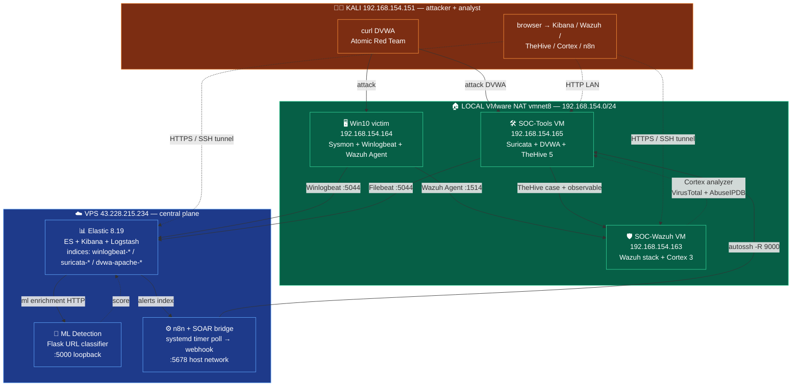
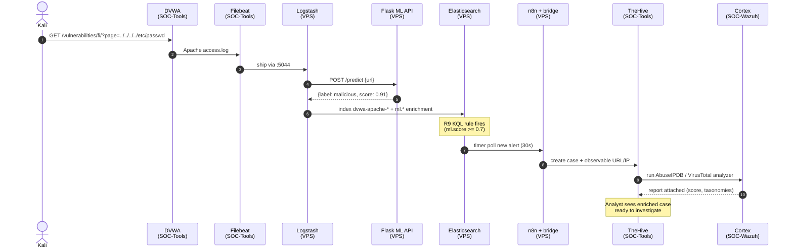

# VN-SOC Lab

> **End-to-end Security Operations Center simulation** — detection engineering, multi-SIEM ops, adversary emulation, ML-based detection, SOAR automation with threat-intel enrichment.

Built solo in ~10 days as a working portfolio for SOC Intern + AI-in-Security Engineer Intern interviews. Every commit corresponds to something actually deployed on real infrastructure (VPS + 4 VMs), an actual rule fired, an actual incident reconstructed, an actual case auto-created.

| Property | Value |
|---|---|
| Status | ✅ **15 phases done** (9 roadmap + 6 extended) |
| Detection rules | **18** (R1-R18) mapped to **19 MITRE ATT&CK techniques**, 4/5 Kibana rule types |
| SIEMs running parallel | **2** (Elastic primary + Wazuh HIDS) |
| Log source indices | **10** (winlogbeat, suricata, dvwa-apache, wazuh-alerts, syslog, docker, yara-scan, cowrie, ueba, vuln-scan) |
| Auto-created TheHive cases (smoke-test) | **34** với Cortex analyzer enrich |
| Advanced skills | YARA malware + Cowrie honeypot + UEBA + FIM + Trivy vuln scan + Sigma workflow |
| Total commits | ~50 |
| Lessons learned documented | **~80** (~5-7 per phase) |

---

## Why this exists

Most SOC intern CVs list tutorial certifications and toy projects. This repo is the work itself — every step has been deployed, smoke-tested, debugged, lessons written down. The goal is to make hiring conversations concrete:

> *"I deployed bare-metal Elastic 8.x + Wazuh full stack across 4 VMs, built a multi-source Logstash pipeline normalising Sysmon + Suricata + Apache to ECS v8, wrote 9 KQL detection rules incl. one ML-based via Flask + TF-IDF, then chained Kibana → custom alert forwarder → n8n → TheHive 5 with Cortex auto-enrich (VirusTotal + AbuseIPDB). Here's the commit history and 34 cases auto-created during smoke-test."*

---

## Architecture (final)



**Data flow trong 1 attack lifecycle:**



For full setup details per host: [`report.md`](report.md) (Vietnamese, ~1700 lines).

---

## Detection coverage — MITRE ATT&CK

| Rule | Tactic | Technique | Source | Verify |
|---|---|---|---|---|
| **R1** | Execution | [T1059.001](https://attack.mitre.org/techniques/T1059/001/) PowerShell | Sysmon e1 | ✅ 5 alerts |
| **R2** | Credential Access | [T1003.001](https://attack.mitre.org/techniques/T1003/001/) LSASS Memory Access | Sysmon e10 | ✅ 1 alert (FP: Defender) |
| **R3** | Persistence | [T1547.001](https://attack.mitre.org/techniques/T1547/001/) Registry Run Key | Sysmon e13 | ✅ 4 alerts |
| **R4** | Credential Access | [T1110](https://attack.mitre.org/techniques/T1110/) Brute Force | Security event 4625 | ✅ 1 alert (threshold rule) |
| **R5** | C2 | [T1071.001](https://attack.mitre.org/techniques/T1071/001/) Web Protocols | Sysmon e3 | ✅ 55 → 0 sau tune |
| **R6** | Reconnaissance | [T1595](https://attack.mitre.org/techniques/T1595/) Active Scanning | Suricata alert | ✅ 4 alerts |
| **R7** | Reconnaissance | [T1595.002](https://attack.mitre.org/techniques/T1595/002/) Suspicious UA | DVWA Apache log | ✅ 9 alerts |
| **R8** | Discovery | [T1083](https://attack.mitre.org/techniques/T1083/) Sensitive File Probe | DVWA Apache log | ✅ 10 alerts |
| **R9** | Initial Access | [T1190](https://attack.mitre.org/techniques/T1190/) Exploit Public-Facing App (ML) | TF-IDF URL classifier | ✅ 9 alerts 100% TP |

→ Detail specs: [`detection-rules/`](detection-rules/) (each rule has KQL + smoke-test + FP analysis).

---

## Tech stack

**Core platforms**
- Elasticsearch 8.19.17 + Kibana 8.19.17 + Logstash 8.19.17 (VPS)
- Wazuh 4.9.2 full stack — Manager + Indexer (OpenSearch fork) + Dashboard (SOC-Wazuh VM)
- TheHive 5.4.0 + Cassandra 4 + ES 7.17 (SOC-Tools VM)
- Cortex 3.1.7 + ES 7.17 (SOC-Wazuh VM)
- n8n 1.74.1 workflow automation (VPS, host network)

**Telemetry**
- Sysmon v15 (SwiftOnSecurity config + custom ProcessAccess rule for LSASS)
- Winlogbeat 8.19.0, Filebeat 8.19.17
- Wazuh Agent 4.9.2-1 (Windows MSI)
- Suricata 8.0.5 + ET Open ruleset (50k+ signatures)

**Detection engineering**
- KQL custom-query + threshold rules
- ECS v8 schema, grok COMBINEDAPACHELOG
- scikit-learn 1.5.2 (TF-IDF `char_wb` + LogisticRegression), Flask + gunicorn

**Targets / adversary tools**
- DVWA Docker (web vuln target)
- Atomic Red Team (PowerShell)

**Threat intel enrichment**
- VirusTotal API (file/hash/URL/IP)
- AbuseIPDB API (IP reputation)

---

## Where to start

- ⭐ **[`MASTER-GUIDE.md`](MASTER-GUIDE.md)** — single-page consolidated reference (recommended entrypoint). Architecture + 14 phases + 17 rules + deploy quick-start + troubleshooting + skills matrix.
- [`report.md`](report.md) — main technical writeup (~1700 lines VI, Pha 1-9 detail).
- [`ELK-GUIDE.md`](ELK-GUIDE.md) — analyst Discover / Dashboard walkthrough.
- Deep dive per phase: `pha{N}-results.md` cho từng pha.

## Repository layout

```
.
├── README.md                          ← bạn đang đọc
├── report.md                          ← main technical writeup (VI, 1700+ lines)
├── roadmap.md                         ← phase planning (deploy-then-document)
├── CHANGELOG.md                       ← append-only log
├── AGENTS.md                          ← AI multi-agent git protocol (optional)
│
├── pha4-results.md                    ← Pha 4 Adversary Emulation
├── pha6-results.md                    ← Pha 6 Network IDS Layer
├── pha7-results.md                    ← Pha 7 Wazuh HIDS Full Stack
├── pha8-results.md                    ← Pha 8 ML Detection Layer
├── pha9-results.md                    ← Pha 9 SOAR & Case Mgmt
├── pha9.5-results.md                  ← Pha 9.5 Cortex Analyzer Integration
│
├── configs/                           ← infra configs (sanitized for git)
│   ├── main.conf                      ← Logstash 3-branch routing + ML enrichment
│   ├── filebeat-soc-tools.yml         ← Filebeat 2-input config
│   ├── docker-compose-dvwa.yml        ← DVWA target
│   ├── wazuh-docker-compose.yml       ← Wazuh full stack
│   └── winlogbeat.conf                ← legacy (now in main.conf)
│
├── detection-rules/                   ← 9 KQL rule specs + NDJSON exports
│   ├── README.md                      ← convention + lessons learned
│   ├── R1-T1059.001-powershell-encoded.md
│   ├── R2-T1003.001-lsass-access.md
│   ├── R3-T1547.001-registry-run-key.md
│   ├── R4-T1110-brute-force-login.md
│   ├── R5-T1071.001-non-browser-outbound.md
│   ├── R6-T1595-network-scan.md
│   ├── R7-T1595.002-suspicious-ua.md
│   ├── R8-T1083-sensitive-file-probe.md
│   └── R9-T1190-ml-malicious-url.md   (+ .ndjson exports)
│
├── incidents/                         ← NIST 800-61 Rev2 reports
│   ├── template-incident-report.md
│   └── VN-SOC-2026-0001-killchain.md  ← 18-min kill-chain reconstruction
│
├── ml-detection/                      ← Pha 8
│   ├── api/Dockerfile                 ← Flask + gunicorn multi-stage
│   ├── api/app.py                     ← /predict /health endpoints
│   ├── api/requirements.txt           ← pinned numpy 1.26.4 (x86-64-v2 fix)
│   └── api/train/                     ← dataset build + model train scripts
│
└── soar/                              ← Pha 9 + 9.5
    ├── n8n/docker-compose.yml         ← n8n host network
    ├── n8n/workflow-kibana-to-thehive.json
    ├── thehive/docker-compose.yml     ← Cassandra + ES + TheHive 5
    ├── cortex/docker-compose.yml      ← Cortex 3 + ES 7
    ├── cortex/application.conf        ← search/auth/analyzer config
    └── bridge/                        ← free-tier replace cho Kibana .webhook
        ├── alert-forwarder.py         ← poll ES alerts → n8n webhook
        ├── vnsoc-soar.service         ← systemd oneshot
        └── vnsoc-soar.timer           ← every 30s
```

---

## Phase index

| # | Phase | Doc | Highlights |
|---|---|---|---|
| 1 | SIEM Backend | [`report.md §4`](report.md) | Elastic 8.19 bare-metal VPS, hardened (UFW, TLS, encryption keys, secrets chmod 600) |
| 2 | Endpoint Telemetry | [`report.md §5`](report.md) | Sysmon + Winlogbeat → 4400+ events/day, 2675 Sysmon raw |
| 3 | Detection Engineering | [`detection-rules/`](detection-rules/) | R1-R5 KQL rules + 8 KQL lessons learned |
| 4 | Adversary Emulation | [`pha4-results.md`](pha4-results.md) | Atomic Red Team chain T1547→T1059→T1110 trong 18 phút, R5 FP -100% |
| 5 | Incident Response | [`incidents/VN-SOC-2026-0001-killchain.md`](incidents/VN-SOC-2026-0001-killchain.md) | NIST 800-61 kill-chain narrative |
| 6 | Network IDS Layer | [`pha6-results.md`](pha6-results.md) | Suricata + DVWA + R6-R8 + 8 lessons |
| 7 | Wazuh HIDS Full Stack | [`pha7-results.md`](pha7-results.md) | Multi-SIEM dual-ship, RAM/disk sizing lessons, MSI race condition |
| 8 | ML Detection (R9) | [`pha8-results.md`](pha8-results.md) | TF-IDF + LogReg, Flask Docker, R9 fired 9 alerts 100% TP |
| 9 | SOAR & Case Mgmt | [`pha9-results.md`](pha9-results.md) | TheHive 5 + n8n + free-tier alert bridge, 34 cases auto |
| 9.5 | Cortex Analyzer Integration | [`pha9.5-results.md`](pha9.5-results.md) | VT + AbuseIPDB enrich, case observable score 100 (Tor exit) |
| 10 | ELK Ops Optimization | [`ELK-GUIDE.md`](ELK-GUIDE.md) | ILM policy + saved objects + Data View filters + runtime field + Maps + Canvas |
| 11 | SIEM Deep Skills R10-R13 | [`pha11-results.md`](pha11-results.md) | EQL sequence + Sigma workflow + geoip + IOC feed URLhaus |
| 12 | SIEM Depth v2 | [`pha12-results.md`](pha12-results.md) | ECS field aliases + log source diversification (syslog + docker) |
| 13 | FIM R14 | [`pha13-results.md`](pha13-results.md) | Wazuh syscheck Win10 + Filebeat ship → Elastic unified dual-SIEM |
| 14 | Advanced SOC R15-R17 | [`pha14-results.md`](pha14-results.md) | YARA malware + Cowrie SSH honeypot + UEBA z-score + Zeek (defer) |
| 15 | Vulnerability Management R18 | [`pha15-results.md`](pha15-results.md) | Trivy Docker+FS + Nikto weekly web + systemd timers, 768 CVE findings |

---

## Lessons learned highlights

Curated subset of ~50 lessons. Full lessons in per-phase docs.

| # | Pha | Lesson |
|---|---|---|
| L1 | 3 | KQL wildcard fail trên text field có `\` hoặc space — phải `.keyword` |
| L2 | 4 | Atomic Red Team time-window trap — alert có thể ngoài now-30m do shipping delay |
| L3 | 4 | False-positive tuning > rule deletion — R5 exclude Antigravity `agy.exe` (FP -100%) |
| L4 | 6 | Logstash ECS v8 auto-rename grok fields (`clientip→source.address`) |
| L5 | 7 | Wazuh full stack RAM minimum thực tế 4 GB (docs nói 2 GB chỉ đúng cho Manager-only) |
| L6 | 7 | MSI auto-enrollment race condition → duplicate agent name; phải force `agent-auth.exe` + restart |
| L7 | 8 | NumPy 2.x binary wheel yêu cầu x86-64-v2; QEMU VPS CPU không support — pin `numpy==1.26.4` |
| L8 | 8 | Synthetic dataset 1.0 AUC che FP thực tế (`/login.php` score 0.60); raise threshold 0.7 |
| L9 | 9 | SSH `-R` default bind 127.0.0.1 — cần `GatewayPorts yes` + bind `0.0.0.0` + container `network_mode: host` để bridge cross-network |
| L10 | 9 | n8n HTTP Request default Method=GET — explicit set POST hoặc TheHive trả 404 (misleading 405) |
| L11 | 9 | Kibana Basic license không có `.webhook` connector → systemd timer poll ES → n8n bridge (free-tier SOAR pattern) |
| L12 | 9.5 | Cortex 3 spawn analyzer container via Docker socket — job_directory phải bind mount HOST path (KHÔNG named volume) |
| L13 | 9.5 | Cortex 3 CSRF strict cho mọi POST sau login — GUI bootstrap only (CLI khả thi tới initial superadmin create) |

---

## Reproducibility

Every phase has both **GUI (preferred)** and **CLI equivalent** instructions in its results doc — explicit project convention. AI agents (Claude Code on Kali, Antigravity on Win10) accelerated the original build, but the docs are written so a reader with no AI access can rebuild the lab in ~6 hours by:

1. Following `report.md` §0 (Prerequisites) → §4 (Pha 1) → §5 (Pha 2) inline.
2. Reading per-phase `pha{N}-results.md` for stages 3-9.5.
3. Skipping AI prompt blocks (they are accelerators, not required steps).

The only artifact that is AI-workflow-specific is [`AGENTS.md`](AGENTS.md) (multi-agent git protocol) — solo human users can ignore it.

---

## Quick setup tour (after cloning repo)

```bash
# 1. Clone (private repo — request access)
git clone git@github.com:gnid31/vn-soc-lab.git
cd vn-soc-lab

# 2. Provision infrastructure (per host) — follow per-phase docs
#    VPS:        report.md §4 (Pha 1) + §5 (Pha 2 Logstash side)
#    Win10:      report.md §5 (Pha 2 endpoint side) + pha7-results.md §3.7
#    SOC-Tools:  pha6-results.md §3 + pha9-results.md §3.3
#    SOC-Wazuh:  pha7-results.md §3 + pha9.5-results.md §3.2

# 3. Import detection rules
#    Kibana → Security → Rules → Import NDJSON từ detection-rules/*.ndjson

# 4. Wire SOAR pipeline
#    autossh tunnels: pha9-results.md §3.5
#    systemd timer:   pha9-results.md §3.7
#    n8n workflow:    soar/n8n/workflow-kibana-to-thehive.json import qua n8n UI

# 5. Smoke-test full chain
curl http://192.168.154.165:8080/vulnerabilities/fi/?page=../../../../etc/passwd
# → R9 fires → ES alert → forwarder → n8n → TheHive case auto-created
# → Cortex analyzer enrich observable
```

Detailed step-by-step per host: each `pha{N}-results.md` has `## 3. Setup stages` section with dual-path GUI + CLI.

---

## Hardening backlog (production gap)

Lab uses lab-grade defaults (chmod 600 secrets, self-signed TLS, default Wazuh password). Production-grade gap list in [`report.md §8 Hardening`](report.md). Highlights:

- Kibana HTTPS via reverse proxy nginx + Let's Encrypt
- Beats client cert TLS (mutual auth)
- ES cert verify mode `full` (currently `none`)
- RBAC + Kibana Spaces per team
- Secrets vault (HashiCorp Vault / SOPS / sealed-secrets)
- Wazuh API protected from default `wazuh-wui:MyS3cr37P450r.*-` password

---

## License & access

Private repository. Access granted on a per-recruiter / per-engineer basis via GitHub invitation. Email `nam@cycloneinstruments.ai`.

— *`gnid31`, Vietnam, 2026.*

**Tech tags:** `siem` `detection-engineering` `mitre-attack` `wazuh` `elasticsearch` `kibana` `logstash` `suricata` `sysmon` `thehive` `cortex` `n8n` `soar` `incident-response` `atomic-red-team` `ml-security` `flask` `docker`
